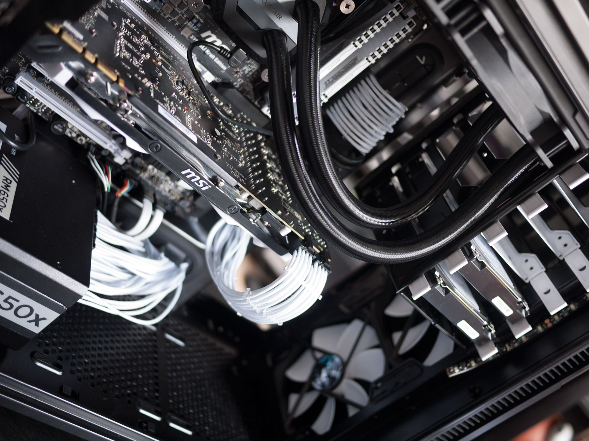
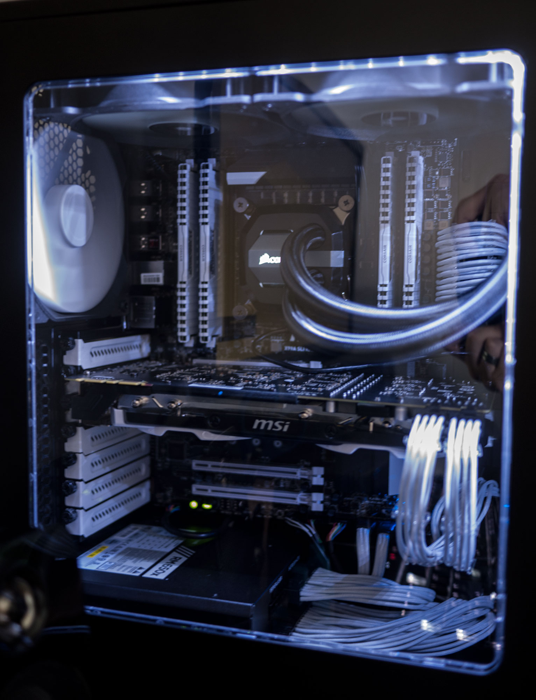
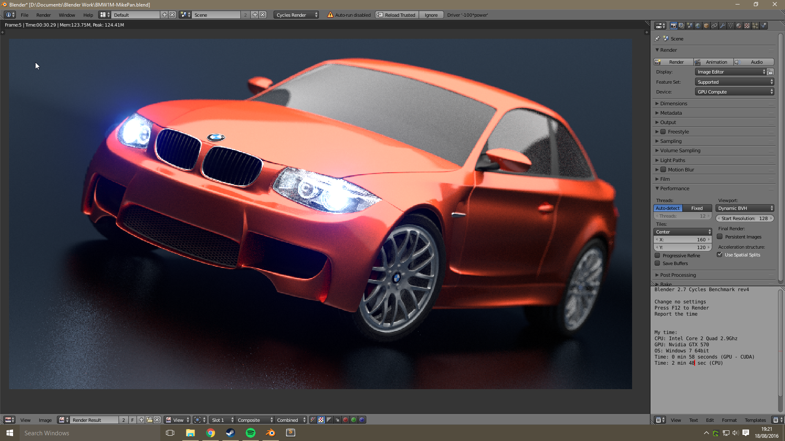

title: Building a PC for Blender
date: 2016-07-08
category: Gadgets

I've been playing with blender for a while now and I've reached the point where my laptop is just not up to the job. I have increasingly found that I abandon projects as adjusting materials and lighting requires hour long renders to see the difference. Having considered all the options;

- **Buying a newer Mac** This doesn't really make sense as it may not actually be an improvement as Apple tend to use AMD graphics cards and Blender seems to work best with NVIDIA cards.
- **Buying a secondhand Mac Pro and upgrading the graphics card(s)** Having spent some time researching this route there doesn't seem to be much useful information available. It seems that the graphics cards might need flashing to make Mac OS recognise them and the risks involved were too large. Plus the cost of a recent, _pre-dustbin_, Mac Pro and a good graphics card was equivalent to building a new PC from scratch.
- **Building a Hackintosh** There's tons of information out there for people that want to go down this route. I had a very cheap netbook running Mac OS X a few years back and it mostly worked fine but there were enough issues that made me not want to rely on it.

I decided that I would bite the bullet and build a Windows PC. Despite the fact that I haven't used Windows regularly for nearly twenty years and I've never built a PC before. So after about six months of research I placed my order and the next day many, many boxes arrived.

[The full list of components is on PC Part Picker](https://pcpartpicker.com/b/kxXH99) but essentially the build consists of a water-cooled Intel i7 3.3Ghz 6-core processor, 32Gb of RAM, an NVIDIA GTX 980ti, two 240GB SSDs and two 3TB HDDs.

## What do I do with all of these things?

With all of the parts in hand and an entire day to myself I set about trying to put the machine together. I've watched countless hours of [LinusTechTips](https://www.youtube.com/user/LinusTechTips), [JayzTwoCents](https://www.youtube.com/user/Jayztwocents) and the [Awesomesauce Network](https://www.youtube.com/user/AwesomeSauceNews) over the last few months, I thought I was ready.

It turns out that building a PC is a lot more fiddly than the professionals above make it look. I intentionally bought a case that has a reputation for being easy to build in and I'm glad that I did. The instruction book that comes with the case walks you through what to install, how and in what order. Nearly every component I ordered came with a fairly hefty manual or installation guide.

Despite all of the instructions I still hit a few snags. I didn't connect a cable to the 8-pin power connector at the top of the motherboard before installing the H110i's radiator. This meant some very careful manoeuvring to get it out without having to disconnect everything.

I also didn't appear to have a 4-pin cable for my power supply. On my motherboard there's a 4, 8 and 24-pin socket for power cables. The manual makes it very clear that you must connect all of them for it to operate correctly. I looked around online and it seems that I was not alone in my confusion, plenty of other people could also not find their 4-pin cable. Apparently the 4-pin socket is optional and is only necessary for people that want to increase the voltage to their CPU for hardcore overclocking. So I didn't connect one and the PC seems to be working fine.

I found cable management more difficult than I expected too. I chose to go all out and had some white, individually sleeved CableMod PSU cables to compliment the build. They look nice enough but I found trying to get them to look neat pretty challenging. Ordering some cable combs and a bit of fiddling seem to have solved that issue now though. Cable management in the back of the case was also a little hairy. I had planned on making it a work of art back there but after fighting with spaghetti for half an hour I decided it was neat enough and the side panel fitted without too much resistance so I called it a day.

Building the PC took me all day in the end, including clearing up all the packaging, manuals, screws, and other ephemera. I'm sure if I were to build another machine it would take a lot less time and I'd be aware of the potential pitfalls along the way. Considering how it turned out I'd say it was a pretty good days work.

##  Bringing it to life

I'm not going to lie, I was pretty sure that it wouldn't boot first time but surprisingly it started up fine. I inserted my Windows 10 flash drive and happily clicked through the install. It went without a hitch and pretty soon I was greeted by a Windows desktop. As the machine has no optical drives I plugged in an Ethernet cable and was pleasantly surprised to see that it automatically connected with no issues.

I got to work installing drivers for the motherboard, the graphics card, the cooler, everything went fairly smoothly. Until I rebooted. On booting up the machine asked for the password I had set a few minutes ago. I entered it and it resolutely refused to accept it. I know the password that I entered was correct but Windows refused. I tried the reset password option and Windows helpfully asked me to insert the CD I didn't have. So I booted back to the installer, formatted all the disks and went through the whole process again. Fun times.

I read/watched a bunch of tutorials on oveclocking and eventually managed to get the CPU stable running at 4.3Ghz and the graphics card also saw a modest increase that got an additional ten fps in the Heaven 4.0 benchmark. I definitely don't know enough about it to explain it to anyone else though so lets move on to the big question...

## Will it blend?

On my laptop the BMW benchmark scene above takes over half an hour to render. On the new PC with an overclocked CPU and GPU the same thing renders on the GPU in 30.29 **seconds**! Even on the CPU it only takes one minute and twenty seconds!

I am so happy with how it all turned out the machine runs brilliantly, blender works superbly and it's still pretty quiet. Hopefully I'll be sharing some new work soon.
