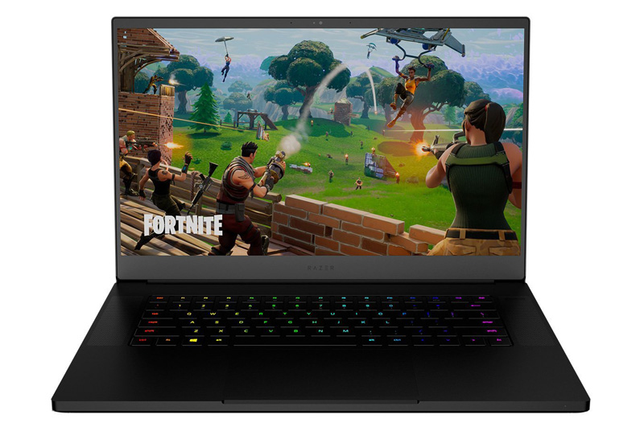
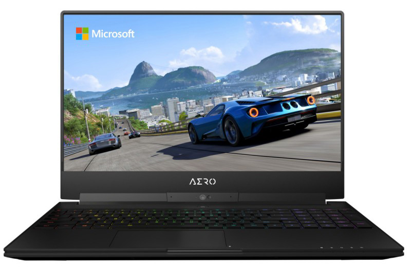
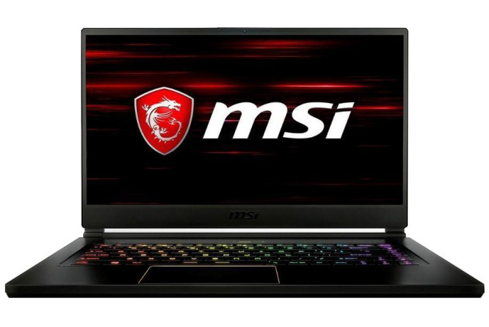
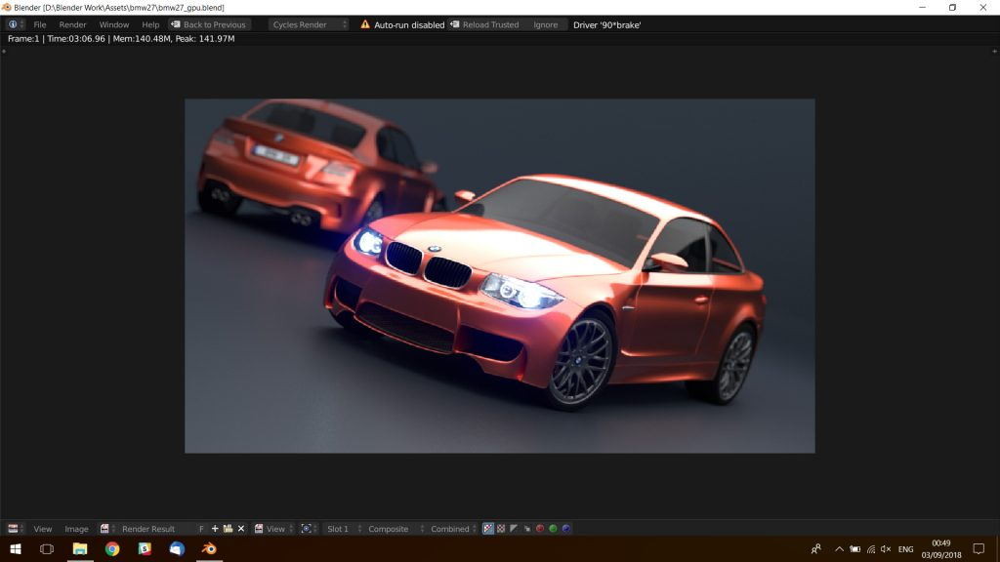

title: Choosing a thin and powerful laptop for blender
date: 2018-09-03
category: Gadgets

Last week I pulled the trigger on a new laptop. I had been looking for something portable, powerful and - surprise, surprise - suitable for working in blender. I had spent several weeks trying to decide exactly which machine to go for. The contenders were the Razer Blade 15, Gigabyte Aero 15X and the MSI GS65 Stealth Thin.

## Razer Blade 15 - The Gamer's Choice

The Razer was originally my first choice, it's basically the MacBook Pro equivalent for gamers, which means it has good internals for the modelling, animation and rendering I want to do. Unfortunately it seems to be constantly out of stock (or not yet released according to Amazon). I even registered directly with Razer to be updated when they came back in stock and have still not heard from them.

Something else that put me off was the keyboard layout. There is a peculiarity with the placement of the right shift and up arrow keys that I feel would be frustrating as someone that switches between keyboards regularly. The final nail in the coffin for the Razer Blade was everything that I read on the web made it clear that Razer have a very bad reputation for customer service, which at this price point is something that I really cared about.

## Gigabyte Aero 15x - The Practical Choice

This seemed like a really logical choice, the same CPU and GPU, more storage and slightly cheaper than the other two too. I just really don't like the design of it. In particular I have no idea why they put the webcam where they did. As much as I'm unlikely to use the webcam often as I plan to keep this laptop for a few years I would like it to be an option.

Also while the idea of having a full size numpad appealed (it's a nice-to-have for navigating views in blender) several users reported that the whole keyboard felt squashed and uncomfortable to make space for it. Lastly I read a number of reports of thermal throttling due to the design. Although in fairness that criticism gets levelled at every machine in the thin and light category.

## MSI GS65 Stealth Thin 8RF - My Choice

Ultimately I liked the design of the MSI the most and in reviews it was rated as being the quietest of the three. This was particularly important to me as I want to be able to work on 3D projects in the living room in the evening while my wife and I are watching TV.

The biggest downside for the Stealth was how difficult it is to upgrade as unfortunately MSI decided to invert the motherboard. So you have to remove the bottom panel of the laptop, disconnect a bunch of thin ribbon cables, remove the motherboard, install RAM & SSDs and then reinstall everything. Of course in the UK doing that will also void your warranty (probably) so I elected to go for the model that came with maxed out RAM and a larger SSD. At some point in the future I will install another SSD in the other slot but 512Gb will be enough for a while.

**(UPDATE: It wasn't enough storage. So first I checked with MSI who confirmed that upgrading the SSD would not void the warranty and then I very carefully stripped the machine apart and swapped in two 1Tb M.2 drives)**

The other horror stories I'd read about the MSI machine were mostly about build quality. It's been under a week so I can't comment on its longevity but it feels solid enough to me. It's not an aluminium unibody so I'd be uncomfortable trying to pick it up one handed while the screen was open but I generally treat my electronics pretty carefully so I'm not particularly concerned. The hinges also seem solid enough, there's no screen wobble while typing and I've not heard the creaks that some users complained about.

## So what's it like?

The machine I bought, the 8RF model, has a six core i7-8750H 2.2Ghz (4.1Ghz boost), 32Gb RAM, 512Gb SSD, an NVIDIA GTX 1070 Max-Q (8GB) and a 15.6" 144Hz 1080p screen. To be frank, it's an absolute beast and yet it only weighs about one gram more than a 15" MacBook Pro.

With Windows, Blender, Substance Painter, Fusion 360, Photoshop, Illustrator, Lightroom, After Effects, and some other bits and pieces installed I have just under 300Gb of space free. I imagine that will fairly quickly fill up as I copy over my texture and HDRI libraries and some training courses from my desktop machine.

I've been using blender every evening this week and it runs really smoothly. The fans remain fairly quiet (almost silent) while modelling, even with the rendered preview enabled in Cycles. They do get a little noisier during a render but it's no where near as loud as I had feared.

As a benchmark I rendered [the usual BMW image](https://www.blender.org/download/demo-files/) on both the new laptop and my existing [desktop machine](http://idw.xyz/building-a-pc-for-blender/), both machines have 32Gb RAM, six core CPUs and dedicated graphics cards with a generation or two of difference between them.

- **CPU: 07:20.51** - **GPU: 03:06.75** - MSI GS65 (i7-8750H & 1070 Max-Q)
- **CPU: 05:58.95** - **GPU: 03:10.98** - Desktop (i7-5820K & 980 Ti)

The laptop's 1070 Max-Q just nudges out the desktop's 980 Ti by 4.23 seconds. Whereas the two year old, water-cooled and overclocked, desktop CPU (running at 4.3Ghz) crushes the laptop's stock one (running between 2.2Ghz and 4.1Ghz) by over a minute! To be fair the render times aren't all that important as I think using a laptop for prolonged final renders is likely to shorten its life as it can't possibly dissipate the heat as quickly as a much larger desktop. So my plan is to work on projects on the laptop and then transfer them over to the desktop (or possibly an online render farm) for final rendering.

If you're interested in gaming benchmarks you should be able to find plenty of them on other reviews. I did test out Doom and Overwatch and they both ran flawlessly at Ultra settings but the fans do tend to kick in pretty heavily. However with modern games coming in at close to 100Gb I can't really install many and besides that's not what I bought the machine for.

Overall I'm really happy with my purchase and I hope that it will continue to serve me well for the next few years.
