title: Custom Nerf Guns
date: 2017-04-06
category: Projects
tags: cosplay, custom, gun, nerf, prop, sci-fi, strongarm

Lately I've been watching a lot of videos about prop making and cosplay. I'm not sure I'm bold enough to dress up myself but I really like the idea of making amazing looking costumes and props from such cheap materials. Unfortunately living in London means our flat is tiny and there's no space for a workshop or even a spare room. Fortunately my wife is awesome and she suggested that we take a long weekend off work so that we could scratch our creative itches. Leave was booked, craft shops, builders merchants and toy shops were visited and a number of Amazon orders were made.

My original plan had been to replicate a large rifle from Borderlands 2 using foam and PVC pipe. However after watching Adam Savage's video where he built a custom Nerf rifle in a day I decided to give it a go.

https://www.youtube.com/watch?v=cwOXSXkW-uE

## The first attempt

I picked up one of the cheaper Nerf blasters on sale in a toy shop for under a tenner. It's called a Strongarm, and it seems pretty oversized for a pistol so I thought it would probably make a pretty cool looking Sci-Fi weapon.

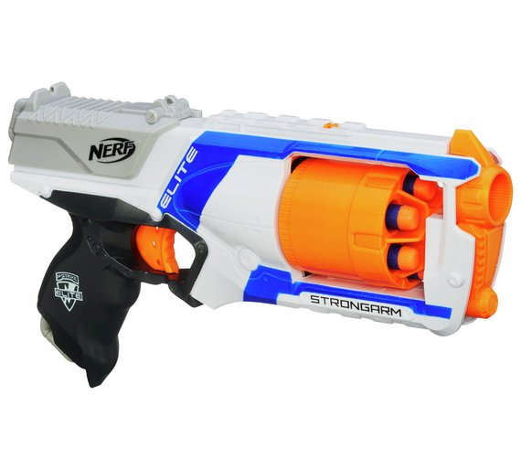

First I had to decide how I wanted to paint it. I found a template on the web, and using a pallet of the spray paint colours I had available planned out the colour scheme.

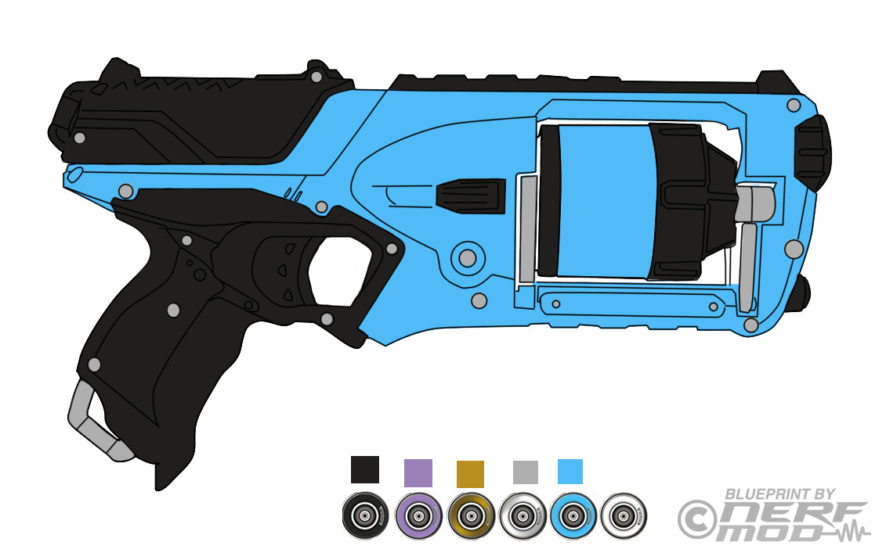

 The project finally gave me a chance to use my Dremel so I got to work removing the raised Nerf logo, Strongarm branding and the safety instructions from the blaster. This left the plastic a bit chewed up so I tidied it up with a few different grits of wet and dry sandpaper. Next up I disassembled the blaster making sure to take lots of pictures of how the internals fitted together. Then I sprayed the whole thing with a matte black spray paint as a base coat.

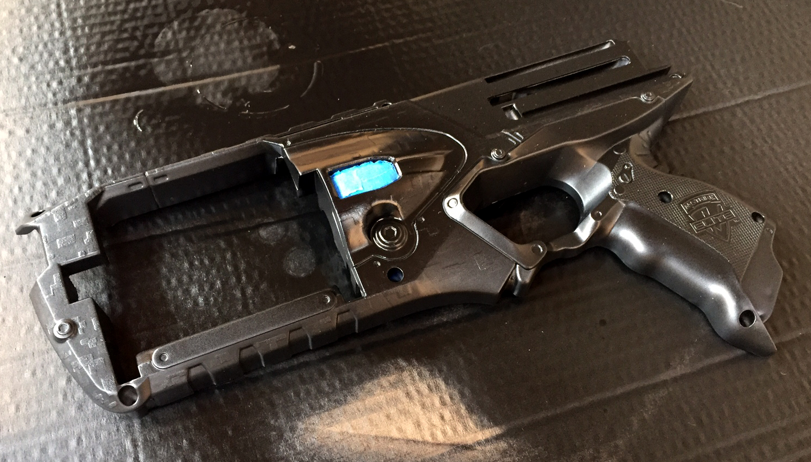

Once it was dry I sprayed the entire blaster with a bright blue spray paint. This is where I hit my first problem. The paint started curling and creating a weird scaly texture. I jumped on to the Facebook group for [The PropTarts of Punished Props](https://www.facebook.com/groups/theproptarts/) (a group for fans of the [Punished Props YouTube channel](https://www.youtube.com/user/punishedprops)) to ask for some advice. Amazingly over thirty people replied to give me advice, what a great community!

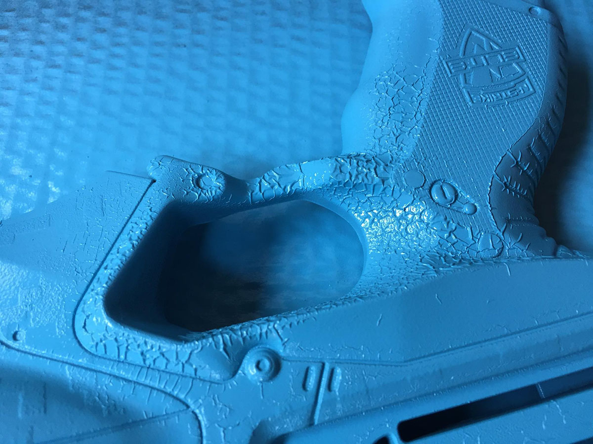

It seems the most likely cause was that I had used a solvent based paint for the base layer and the blue acrylic paint had reacted to it. Lesson learned. When it was dry I smoothed out the worst of it with some wet sandpaper and it didn't look too bad. One of the other suggestions I was given was that spray paint works best if both the can and the surface you're spraying are warmed up first. So I gently warmed one of the two pieces that make up the slide using a heatgun. It promptly melted and deformed. Second lesson learned. After a bit of heating and bending I managed to get it to fit back on the blaster but it was still pretty mangled.

Next up I masked off the sections I wanted to stay blue leaving only the grip and the "tactical rail" uncovered and sprayed them gloss black. In hindsight I think I probably should have gone with a more matte black but it was beginning to look like my plan.

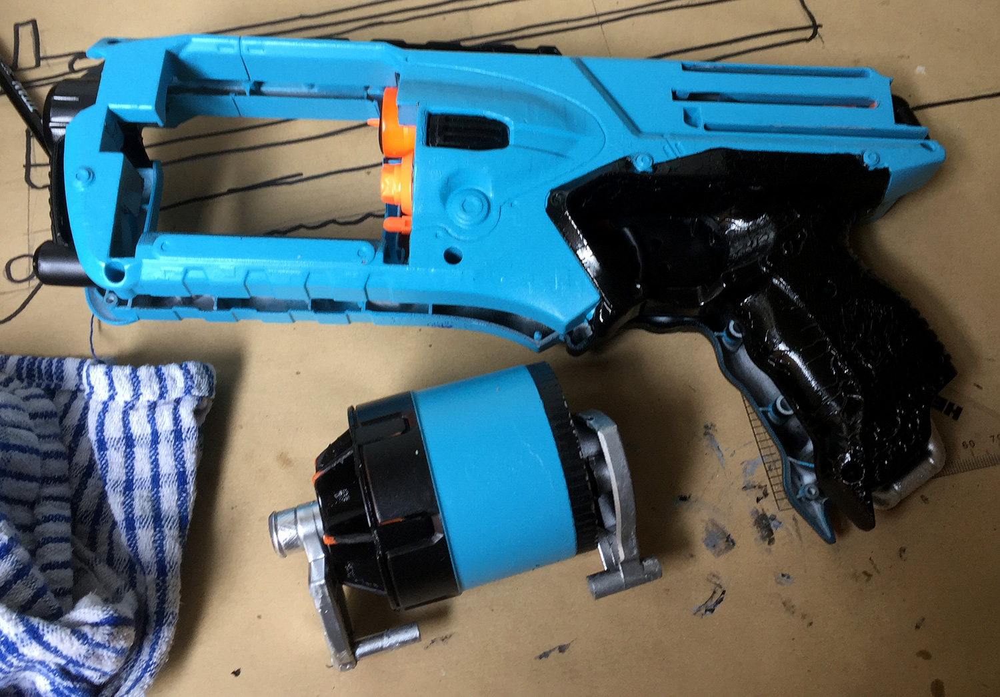

As you can see from the image above I chipped quite a lot of paint off of the cylinder while trying to fit the two halves back together. It took a considerable amount of force to get it back together and in the end I resorted to covering it with a tea-towel and hitting it with a rubber mallet. There's got to be a better way.

With the blaster reassembled I gave the whole thing a coat of a matte clear top coat. Once it had cured I started work on the weathering, touch-ups and finer details. I was pretty proud of the end result.

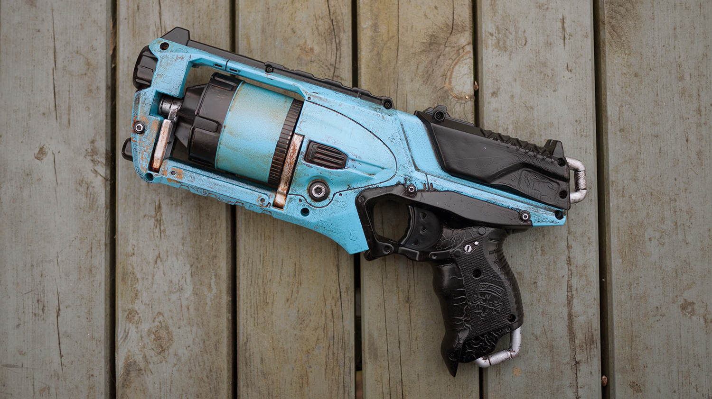

## The second attempt

Having discovered what not to do and armed with some [actual primer](https://www.amazon.co.uk/Autotek-AT00PPG500-500ml-Plastic-Primer/dp/B005QJWNAA/) I figured I'd give it another go. So the following weekend I started work on a smaller pistol, a Nerf Firestrike Elite. It's a single shot blaster with an integrated "laser sight". It has a very futuristic looking silhouette and I thought I could probably get it done fairly quickly as it's much smaller than the Strongarm above.

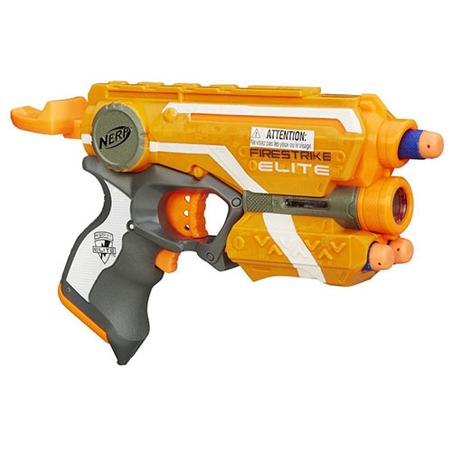

I looked around online for an existing template to work out the colour scheme on. I was unable to find one so I threw one up together in Illustrator. It's not perfect but it's good enough fo figuring out a colour scheme.

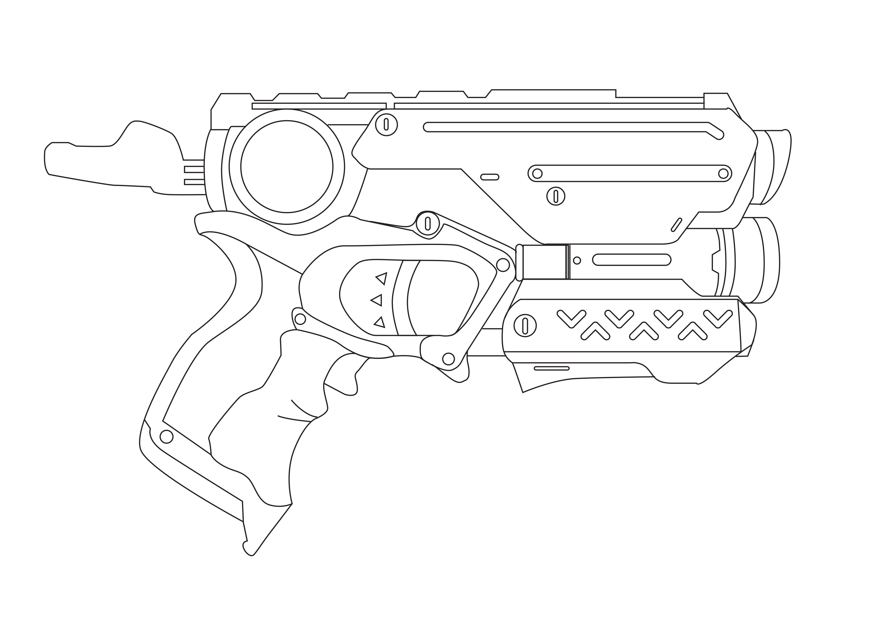

Having bought a few more colours of spray paint I decided to go with a lighter and more muted colour scheme this time to see how that would work out. I also wanted to break up the shapes of the gun a bit so I used the moulding of the gun to separate the sections of colours.

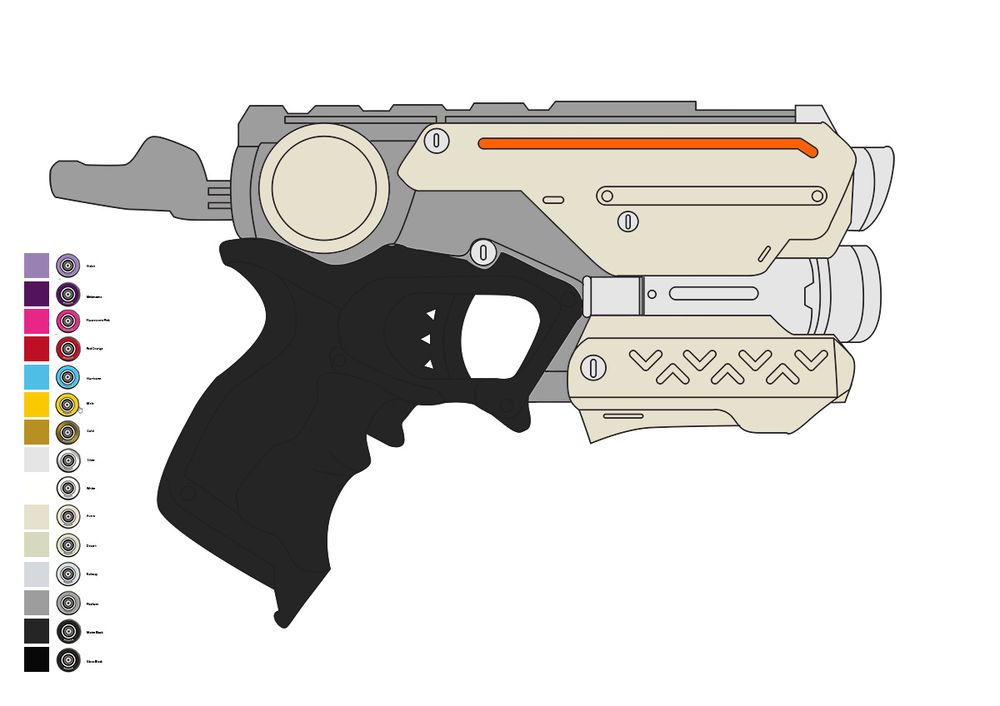

As before I ground off the NERF logo, Firestrike branding and the safety instructions. I used a much lower speed this time and that left me with a lot less sanding to do afterwards. Then I roughed up all the surfaces of the blaster with some wire wool to give the paint something to grip into.

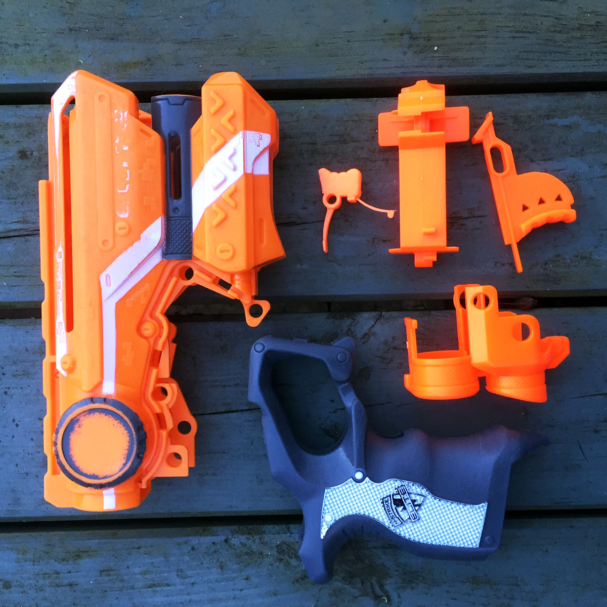

The whole thing got painted with a grey primer and left to dry. Once it was dry I sprayed the whole thing once again with a slightly different shade of grey spray paint. Then the masking began. It took quite a while to cover all of the sections I wanted to stay grey. I used [3M blue painters tape](https://www.amazon.co.uk/gp/product/B00004Z4CP) and a scalpel to mask as accurately as I could and then sprayed the ivory coloured sections. When I peeled off the tape I was pretty pleased with the results (and confident I could hide any mistakes with weathering later on). The grip got sprayed matte black and the barrel got sprayed silver.

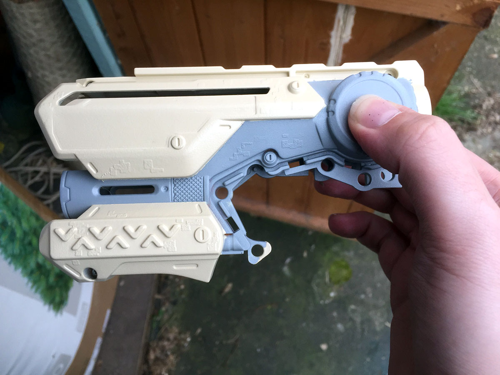

I decided that I didn't want to mask up the whole thing again to spray they cylinder at the front silver so I painted that in with a brush along with the screws and  the plaque. I did the same thing for the black dial above the grip. The handle got a matte clear coat and the rest of it got a gloss clear coat. Then I had to reassemble the blaster and reconnect the wires and laser, again taking lots of pictures before made this a lot easier than it could have been. Next up came the weathering and a final clear coat which left me with this.

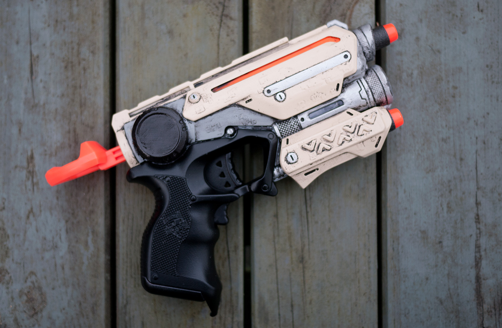

## ...and the rest

So I got a little carried away and won an eBay auction for someone's Nerf collection. So now I have thirteen more blasters of varying styles and sizes to work on. I'm sure I'll post the finished versions online as I get them finished.

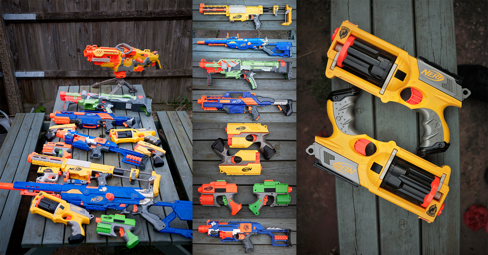
