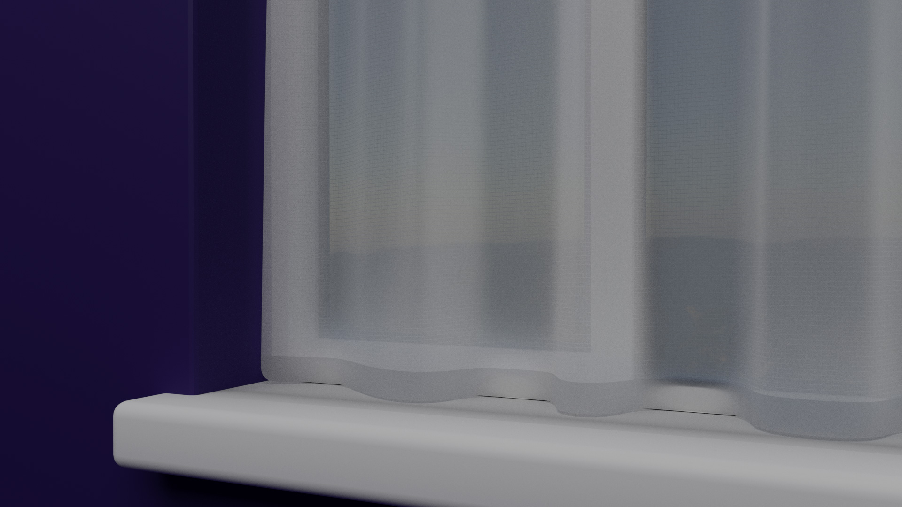

title: Material: Net Curtain
date: 2017-07-13
category: Blender
tags: blender, cycles, free, material, net-curtain, nodes

I'm currently working on modelling the whole interior of the house my wife and I are buying. I'm one room in so far but I'll cover that in detail in another post soon. I hit a snag when I was trying to model the curtains for the windows though.

How on earth do you make a net curtain material?

I tried using the translucent material, then I tried using it mixed with the transparent material but nothing seemed quite right. I had a brief chat with Alex Saplacan on the UK & Ireland Blender Users Slack group and he suggested using Wave Texture nodes to generate the lines in the fabric. After some fiddling about I came up with this which I think works pretty well.

Applying it to a plane that I'd distorted using the cloth simulation gave a pretty believable result…

…and up close you can see the very fine fibres.

Hopefully someone out there will find this useful. I hope to share more materials as I make them throughout this project. I might also have to think about changing the design of this site to make it easier to find them once there's a decent library.
