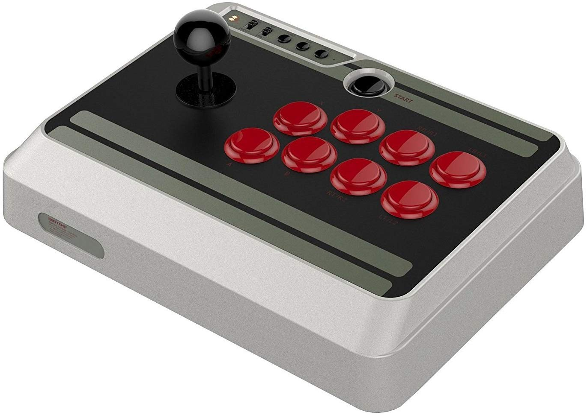
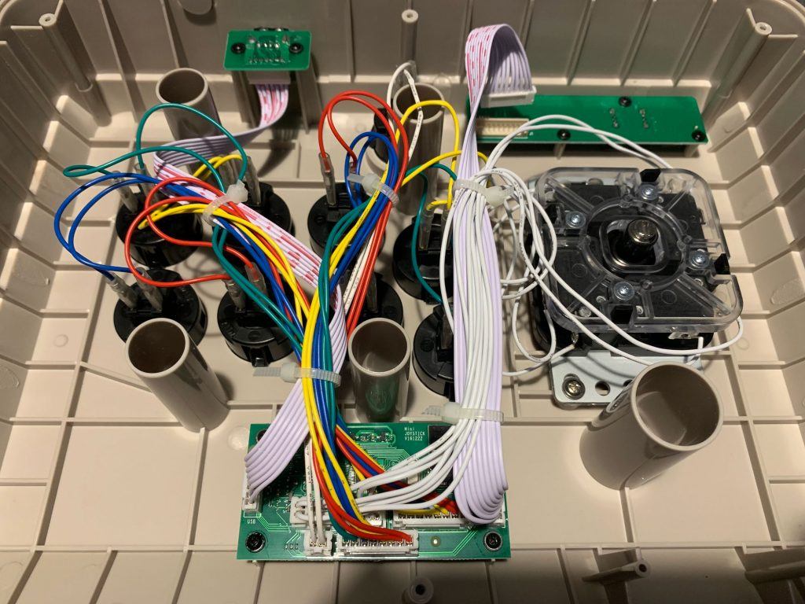
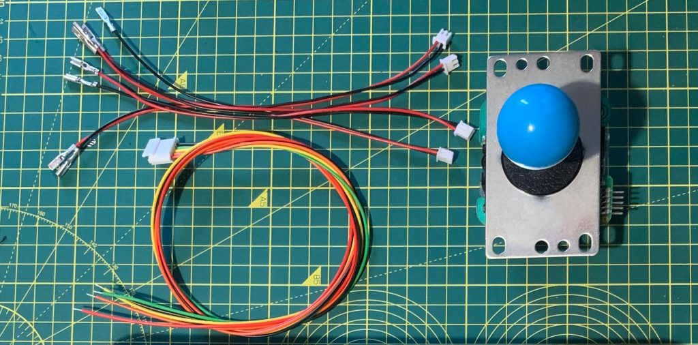
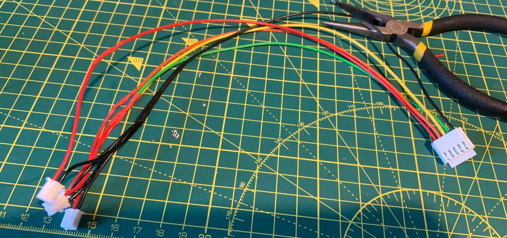
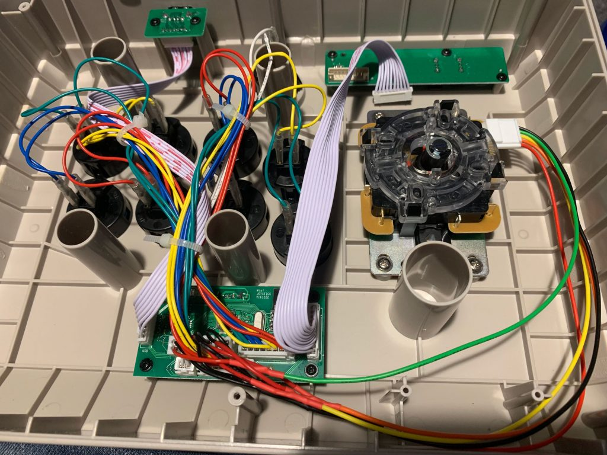
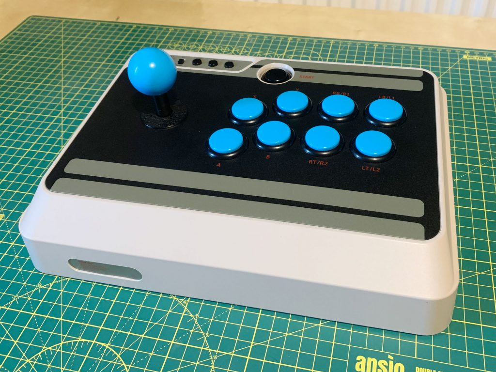

title: Sanwa Upgrade for 8Bitdo N30 Arcade Stick
date: 2019-04-27
category: Projects
tags: 8bitdo, gaming, sanwa

Recently I've been getting back into fighting games and playing on an Xbox One controller just wasn't cutting it. I did a little research into Fight Sticks (or arcade sticks as I would have called them) and it turns out that they're still pretty expensive and they rarely support wireless.

* * *

### A New Challenger Approaches...

The [N30 Arcade Stick from 8Bitdo](https://www.amazon.co.uk/8Bitdo-6922621500278-N30-Arcade-Stick/dp/B073ZNXFL6/) is one of the few arcade sticks currently on the market that supports any wireless connectivity. It can connect to either a PC or a Nintendo Switch wirelessly over bluetooth or physically over a USB cable.

Better still it uses standard sized buttons and has a regular joystick mount which makes it much easier to customise and upgrade it later. The [Sanwa 30mm buttons](https://www.arcadeworlduk.com/products/Sanwa-OBSF-30-Arcade-Button.html) are a straight swap for the ones that come installed in the N30.

### How to replace the buttons

- **Suggestion:** Disconnect the bluetooth connector (shown top right in the photo below) before you start swapping components. I'm not sure that this makes any difference but it will stop the controller trying to pair or send commands over bluetooth.
- Unscrew the six screws on the back panel and pop it off.
- Gently remove both spade connectors from the back of the button. I used needle-nosed pliers, gripped the base of the spade connector, not the wire, and gently wiggled them off.
- Push in the tabs on either side of the, now disconnected, button and gently push it out of the enclosure.
- Reverse the process to install your new buttons, pressing firmly from the outside until you hear the button click into place.
- When reconnecting the wires it doesn't matter which connector goes on which spade. I would suggest doing one button at a time though so you can keep track of which pair goes to which button.

* * *

### How to replace the joystick

If, like me, you're planning to install a Sanwa joystick into the N30 then you'll need to make an adapter cable to connect between the 5-pin connector on the joystick and the four 2-pin connectors on the circuit board.

I am no electrical engineer and apart from some wire cutters, wire strippers and a soldering iron I don't have many tools for anything electrical. So along with a [Sanwa joystick](https://www.arcadeworlduk.com/products/Sanwa-JLF-TP-8YT-Ball-Top-Joystick.html) and [wiring harness](https://www.arcadeworlduk.com/products/Sanwa-JLF-H.html), I also bought four [ready made two pin connectors](https://www.arcadeworlduk.com/products/replacement-2-wire-harness-for-zero-delay-usb-board.html).

**Note:** You'll need to be able to solder two wires together to follow these instructions, if you don't know how there's a [simple tutorial here](https://www.youtube.com/watch?v=Z6ptUhRV3hM).

- **Suggestion:** Disconnect the bluetooth connector (shown top right in the photo of the inside of the stick at the end of the previous section) before you start swapping components. I'm not sure that this makes any difference but it will stop the controller trying to pair or send commands over bluetooth.
- Hold the cables inside the case to get an idea of how long they need to be and roughly cut them to length.
- Prepare the wires by stripping about 1cm from the end of each and then slip a bit of heatshrink over it and slide it as far away from the join as possible.
- Solder the four black wires of the 2-pin connectors to the black wire from the joystick harness.
- Then join one of the other coloured wires of the joystick harness to the red wire from a 2-pin connector. Repeat for all four of the coloured wires as shown in the diagram below.

You should end up with an adapter cable that looks something like this.

- To remove the original joystick from the N30 place a flat-head screwdriver into the screw on the bottom of the shaft and unscrew the ball from the top of the stick. Then remove the shaft and dust covers.
- Back inside the enclosure, carefully snip the cable-ties holding the joystick wiring to the ribbon cable.
- Disconnect the four 2-pin joystick connectors from the board. I used a small pair of needle-nosed pliers for this but if you have more delicate hands I expect you could use your fingers.
- Now unscrew the four screws holding the joysticks mounting plate to the enclosure and remove the joystick.
- It's now just the reverse process to install our new Sanwa joystick and adapter cable. Hold the mounting plate in place and replace the screws.
- Put the dust and shaft covers on the joystick and screw the ball on while holding a flathead screwdriver against the screw at the bottom of the shaft.
- Plug in the five pin connector on the right of the joystick.
- Provided that you've mounted the joystick in exactly the same orientation as shown below then you need to connect the 2-pin connectors to the following connectors: Green is Right, Yellow is Left, Orange is Up, and Red is Down. The connectors are labeled on the circuit board.
- If you unplugged the bluetooth cable as I suggested above then make sure you reconnect it before reattaching the back plate with the six screws and then you're done!

Now you just need to connect the stick to your gaming platform of choice and make sure it all works as expected. Then sit back and enjoy your newly upgraded stick in all its glory!

There's a very good chance that there will be a follow up to this post where I build my own (larger and more solid) enclosure and transplant the guts of this stick into it. I'll add a link when it's available.
