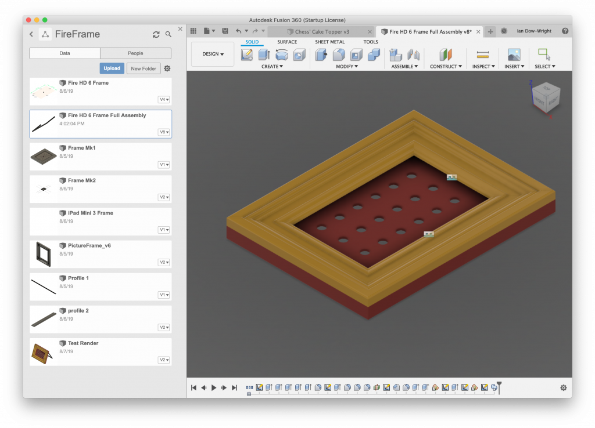
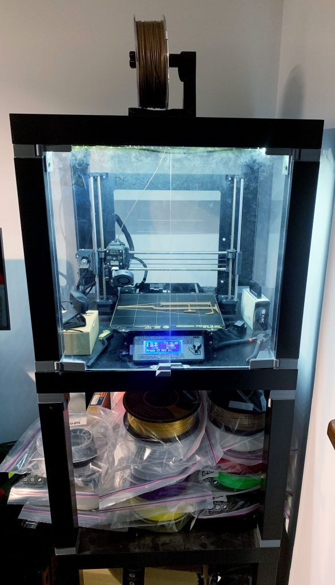
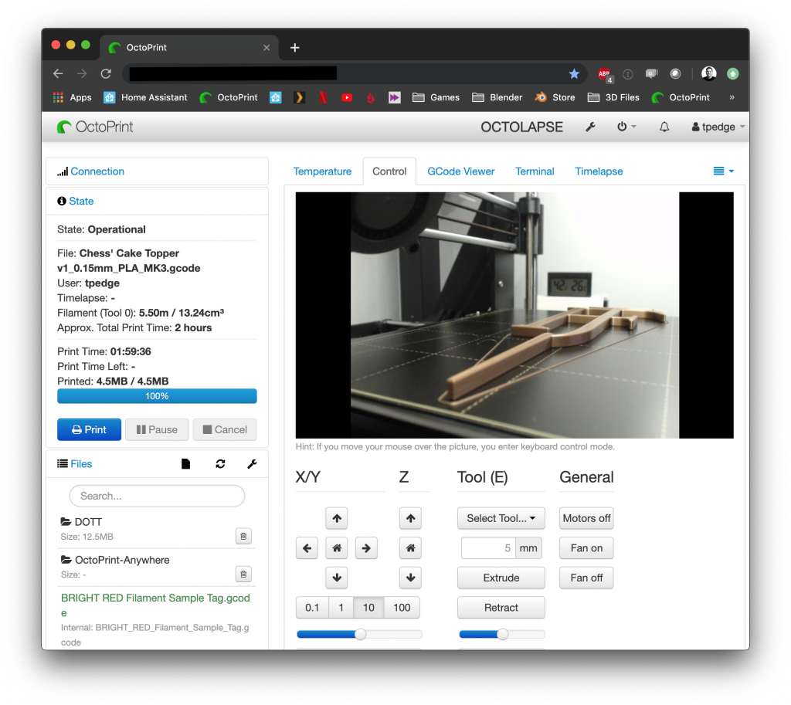

title: So you’re thinking of buying your first 3D printer...
date: 2019-08-11
category: Advice
tags: 3d, 3dprinting, printing

The ability to print out almost any solid object you can imagine at home is undeniably awesome but there are a few things that are worth considering before you buy your first printer.

*(Please note this post is specifically about FDM/Filament printers. MSLA/Resin printers are an entirely separate subject although many of the same considerations apply)*

## Do you enjoy tinkering with machines?

3D printers have matured a lot in a short space of time but they are still arguably not quite at the level of refinement of most other consumer electronics. At the very least you will need to carry out the basic calibration and maintenance of your printer. It’s also likely that sometimes things won’t work as you expect and you’ll need to troubleshoot issues that arise.

There are many dedicated communities for 3D printing and specific 3D printers online so solutions to most common issues are likely to have already been discussed, you’ll just need to find them. Depending on where you purchase your printer from and who made it you may be able to get some technical support from the supplier or the manufacturer too.

## Where will you put the printer?

3D printers come in a wide range of shapes and sizes but most of them will fit within a space that's around 50cm x 50cm x 50cm. Keep in mind that ideally once you've got your printer setup and all the settings dialled in you don't want to have to move it again.

When thinking about where you're going to put your printer consider that it may be running for extended periods of time, day and night. **Printing can be a very slow process**, from memory my longest print so far was about twenty-eight hours!

**Printing is not silent**. Exactly how loud it is will depend on your specific machine and setup but personally I wouldn't want to try and sleep in the same room as a running printer.

**Having a 3D printer in your bedroom is probably a bad idea** all around due to the [fine air particulates that get released during printing](https://3dprinting.stackexchange.com/a/3250). Building an enclosure for your printer and considering ventilation might help to combat this but you should do your own further research if you decide to go down this route.

## What is it that you want to print?

There’s an ever-growing wealth of free and paid objects available to print from sites like [Thingiverse](https://www.thingiverse.com/), [MyMiniFactory](https://www.myminifactory.com/), [Cults](https://cults3d.com/en), [TurboSquid](https://www.turbosquid.com/Search/3D-Models/free/stl), [PrusaPrinter](https://www.prusaprinters.org/prints) and others.

Which is great if you can find the things you want to print but what do you do if you can’t find what you’re looking for?

## Are you interested in learning 3D modelling skills?

Whether you just want to modify an object you’ve downloaded to fit your purpose or you want to design something from scratch, knowing your way around a 3D program will likely become a requirement.

If you’re completely new to working in 3D, I would recommend [Fusion 360 from Autodesk](https://www.autodesk.co.uk/products/fusion-360/overview). If you're using it as a hobbyist (i.e not making money from using the software or the things you make with it) you can get a free license that you can renew every year.

There's a [Fusion 360 for absolute beginners course](https://f360ap.autodesk.com/courses/getting-started-in-fusion-360/lessons/lesson-1-course-overview) on their site and there are [tons of tutorials on YouTube](https://www.youtube.com/results?search_query=fusion+360).

Personally, I also use [blender](https://www.blender.org/) although it’s more aimed towards artwork, VFX and animation than CAD so I’d recommend sticking with Fusion 360 if your goal is specifically modelling objects for printing.

## Will you be building an enclosure for your printer?

Putting the printer in an enclosure helps make it a bit quieter and also helps to contain some of the smells that various filaments give off (again, please do your own research regarding safety). Depending on the enclosure you build it might also give you somewhere to store the spools of filament that seem to magically accumulate as soon as you buy a printer.

For some filaments you will need an enclosure to get successful prints. To get the best results from filaments like ABS or Nylon you'll need a heated bed as well as having the printer in an enclosure to maintain a higher ambient temperature around the print.

The simplest enclosure is just a cardboard box to put over the printer while it's running but you can obviously get as elaborate as you like. I went with the [Lack Table Enclosure that Prusa designed](https://blog.prusaprinters.org/cheap-simple-3d-printer-enclosure/). There are some [pieces to print](https://www.thingiverse.com/thing:2864118) and then you combine them with some [Lack tables from Ikea](https://www.ikea.com/gb/en/p/lack-side-table-black-20011408/) and some acrylic sheets to build an enclosure. I took their advice and also added LED lighting, a smoke alarm plus a digital temperature and humidity sensor too.

## How will you monitor your prints?

If you read the paperwork that comes with most 3D printers somewhere it will almost certainly say something like, "Do not leave this printer unattended while in use". This is clearly to try and limit the manufacturer's liability in the event of an incident but it's also a reasonable point.

Printers get very hot in use and are designed to squirt out molten plastic in a particular pattern but sometimes things go wrong and blobs of molten plastic end up in the wrong place. Some budget printers are thrown together by unscrupulous people who save money by skimping on safety features or using inadequate components. Any of these issues have the potential to ruin your print or do far worse but it's not practical to watch your printer for 20+ hours so what can you do?

I have my printer connected to a [Raspberry Pi](https://thepihut.com/collections/raspberry-pi/products/raspberry-pi-3-model-b-plus) running [OctoPi](https://octoprint.org/download/) with a [webcam](https://www.amazon.co.uk/Logitech-Calling-Recording-Microphones-Adjustable/dp/B006A2Q81M/ref=sr_1_3?crid=OH4H6QXX9ZWP&keywords=logitech+c920&qid=1565545034&s=gateway&sprefix=logi%2Caps%2C183&sr=8-3) connected to it. OctoPi allows me to upload files to my printer, start and stop print jobs, set and monitor the temperatures of the bed and nozzle, view the printer from the webcam, move each axis of the printer, create time-lapses and tons more features that I've yet to even use.

I then use a service called [OctoPrint Anywhere](https://www.getanywhere.io/pub/login) that lets me access it from outside the house. The printer itself is also plugged into a smart plug socket so as a last resort if I can't stop the print with OctoPrint I can cut power to the printer remotely. I am confident enough in my printer and my setup that I'm happy leaving the printer running while I'm out of the house and periodically checking in on it during the day.

If you're not comfortable leaving prints running while you're out of the house I'd recommend looking into ways you can pause prints otherwise you'll be severely limited to what you can print in a few hours.

## Okay so you’re still sure you want to buy one but which printer should you buy?

My recommendation is the [Prusa i3 MK3S](https://shop.prusa3d.com/en/3d-printers/180-original-prusa-i3-mk3-kit.html). I have the previous version the Prusa i3 Mk3 but at some point I'll upgrade a few bits to make it into a Mk3S.

It’s definitely not the cheapest printer but Prusa offer excellent customer support, there’s a huge and very active community and it’s an open source project so buying from them helps fund R&D which ultimately improves the technology for everyone and it gets excellent reviews; [All3DP](https://all3dp.com/1/original-prusa-i3-mk3-review/), [techradar](https://www.techradar.com/uk/reviews/original-prusa-i3-mk3s), [Tom's 3D](https://toms3d.org/2018/02/12/important-3d-printer-original-prusa-i3-mk3-review/), [Hackaday](https://hackaday.com/2018/10/22/a-close-look-at-the-prusa-i3-mk3/).

It’s £699 to buy the printer in kit form with one 1kg roll of filament. The main upsides of building it yourself are that you’ll save £200 and have a better understanding of how it works, which will help if you have to troubleshoot any issues in future.

It took me about two days to build my printer and get it up and running. It comes with all the tools and fixings needed, it all just bolts together, there’s no soldering, the instructions are fantastic, it has built in software for calibration and the first print was flawless. Plus it comes with gummy bears that the instructions direct you to reward yourself with throughout the build!

I spent a long time trying to decide between a genuine Prusa i3 and one of the many clones that exist when I bought my printer. Ultimately I decided to go with the Prusa because:

- I had confidence in the Prusa brand and their customer support based on everything I've read and heard.
- I was nervous that if I bought one of the clones and it didn't work well that I would spend all my time trying to get a decent print out of it and ultimately get frustrated and put off 3D printing completely.
- Prusa have, so far, offered an upgrade path from one revision of their printers to the next - it will cost me [under £20 in components from Prusa](https://shop.prusa3d.com/en/upgrades/898-original-prusa-i3-mk3-to-mk3s-upgrade-kit.html) plus some printing to upgrade my Mk3 to a Mk3S. Which means the printer can grow with me.

If you can't or don't want to spend the £699 to buy from Prusa then there are quite a lot of other options but I can't vouch for them.

As I mentioned due to the i3 being an open hardware project there are many clones available to buy on [Amazon](https://www.amazon.co.uk/s?k=3d+printer+i3&ref=nb_sb_noss_2), [AliExpress](https://www.aliexpress.com/premium/3d-printer-i3.html?SearchText=3d+printer+i3&d=y&initiative_id=SB_20190811104353&origin=y&catId=0&isViewCP=y&switch_new_app=y), [BangGood](https://www.banggood.com/search/3d-printer-i3.html) or [DealExtreme](https://www.dx.com/s/3d%20printer%20i3?cateId=0). They vary in price from £150 up to around £500. I've seen horror stories and various warnings about different models but I have also heard good things about i3 clones from Ender and Creality.

There are also many models of printer other than the i3, although they do tend to be the most common. Printers come in a wide variety of sizes, shapes and technologies so I'd recommend that you look for user reviews for any other models you're considering.
