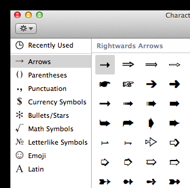

title: Typing Symbols on a Mac
date: 2012-09-07
category: Advice
tags: mac, special-characters, symbols

**Note: This post was originally published on iamianwright.com it's been moved here for archival purposes.**

Something that has always bugged me is the way that you enter symbols on a Mac.  I can never find what I'm looking for and tonight was no exception.  I wanted to type a musical note earlier this evening, couldn't find it so I had a quick look online.  I found an article that mentioned opening the Special Characters window, which I had already looked in but then it said to choose the Symbols section.

As you can see I don't have a symbols section.  I casually clicked the cog at the top left and suddenly was able to enable all the sections that I previously couldn't find including the Musical Symbols.  I'm not sure how long it's been like this but I'm glad I've finally got access to all the symbols again.  I'm posting this on the off chance it saves someone else some time.
